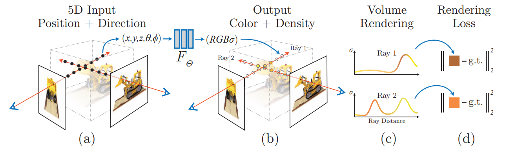
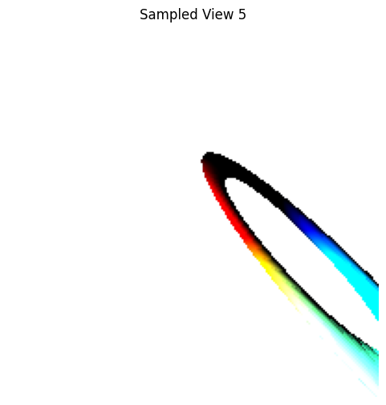
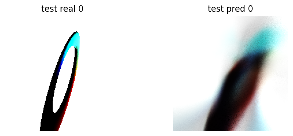
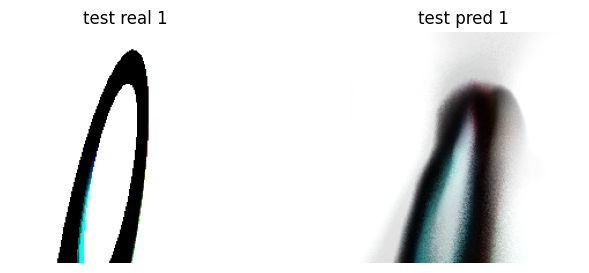
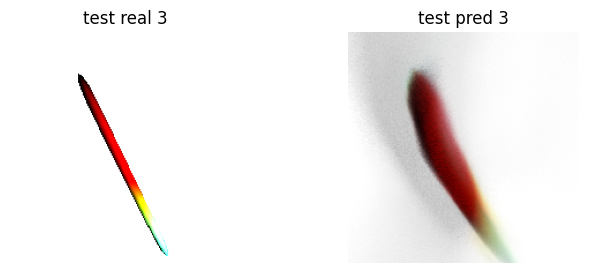

# NeRF from scratch
Wanted to play with NeRFs, so that's that.
Neural Radiance Fields (NeRF): "synthesizing novel views of complex scenes by optimizing an underlying continuous volumetric scene function using a sparse set of input
views" [1]

Ran it on Google colab T4 GPU. Used gemini to generate the problem and rendering views: an elongated, illuminated and colorful torus.

Used a basic MLP Feedforward NeRF, positional encoding like described in the original paper [1].

In every epoch, I go over all (sampled once) given 50 training views. From each view\step, I sample only some of the pixels (for computational efficiency in every step).

I also added an option to separate a single view to different batches according to the batch size.

After playing with it a bit, it seemed like unweighted pixels loss didn't allow learning, and instead the output was fixed to be the color of the background, but weighting according to background\not-background with {0.1, 1} weights solved that issue.

Because colab is limited, it only ran for 200 epochs, but it already seems to be starting to do relatively okay:

[1] Mildenhall, B., Srinivasan, P. P., Tancik, M., Barron, J. T., Ramamoorthi, R., & Ng, R. (2021). Nerf: Representing scenes as neural radiance fields for view synthesis. Communications of the ACM, 65(1), 99-106. [Link](https://arxiv.org/abs/2003.08934).
